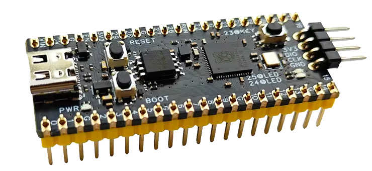

## Support for the Raspberry Pi microcontroller development boards

### Supported boards

#### [Raspberry Pi Pico 2](pico2)

Raspberry Pi [Pico 2](https://www.raspberrypi.com/products/raspberry-pi-pico-2/) development board ([RP2350](https://www.raspberrypi.com/products/rp2350/) + 4 MB QSPI NOR Flash [W25Q32RV](https://www.winbond.com/hq/product/code-storage-flash-memory/serial-nor-flash/?__locale=en&partNo=W25Q32RV))

#### [WeAct RP2350A-V10-16MB](weacta10)

WeAct Studio [RP2350A-V10-16MB](https://weactstudio.aliexpress.com/store/910567080/pages/all-items.html?sortType=bestmatch_sort&SearchText=RP2350A_V10) development board ([RP2350](https://www.raspberrypi.com/products/rp2350/) + 16 MB QSPI NOR Flash [W25Q128JVSQ](https://www.winbond.com/hq/product/code-storage-flash-memory/serial-nor-flash/?__locale=en&partNo=W25Q128JV)). This board  has several differences compared to the Pico 2 and many clones, where the most important is the linear regulator instead of SMPTS to provide VCCIO which considerably reduces the overall noise on the board and the output voltage ripple at the expense of the higher power consumption. It's mostly pin compatible with the original Pico 2 (the difference is an additional analog input in place of VREF).

### Directory structure

Every supported board has its directory here. Each of them contains three subdirectories:

#### board

The `board` directory contains Go packages that provide the interface to the peripherals available on the board such as buttons, LEDs, etc.

#### doc

The `doc` directory may contain documentation, diagrams, photos and other useful resources.

#### examples

The `examples` directory contains simple programs that demonstrate how to work with the board in Go.
