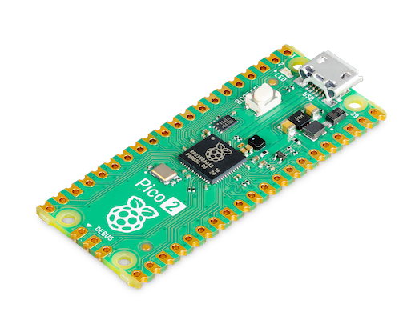

## Support for the Raspberry Pi microcontroller development boards

### Supported boards

#### [Raspberry Pi Pico 2](pico2)

Raspberry Pi [Pico 2](https://www.raspberrypi.com/products/raspberry-pi-pico-2/) development board ([RP2350](https://www.raspberrypi.com/products/rp2350/) + 4 MB QSPI NOR Flash [W25Q32RV](https://www.winbond.com/hq/product/code-storage-flash-memory/serial-nor-flash/?__locale=en&partNo=W25Q32RV))

### Directory structure

Every supported board has its directory here. Each of them contains three subdirectories:

#### board

The `board` directory contains Go packages that provide the interface to the peripherals available on the board such as buttons, LEDs, etc. It also contains a `system` package which, when imported, configures the whole system for typical use. Other packages in the `board` directory import the `system` package to ensure the proper operation of the board. If you don't import any package from the `board` directory in your application you should import the `board/system` package anonymously or copy the code from its `init` function which has the advantage that you can adjust it to better suit your needs.

#### doc

The `doc` directory may contain documentation, diagrams, photos and other useful resources.

#### examples

The `examples` directory contains simple programs that demonstrate how to work with the board in Go.
